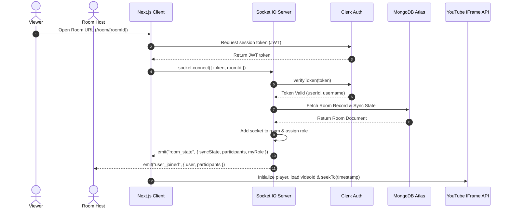
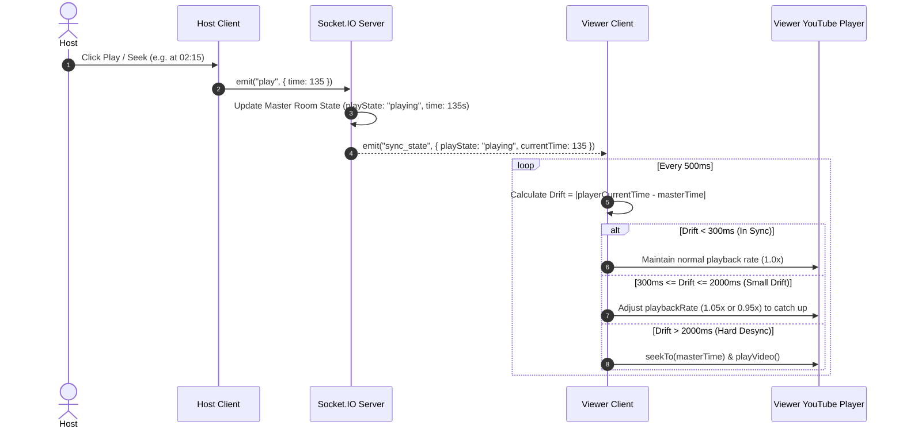
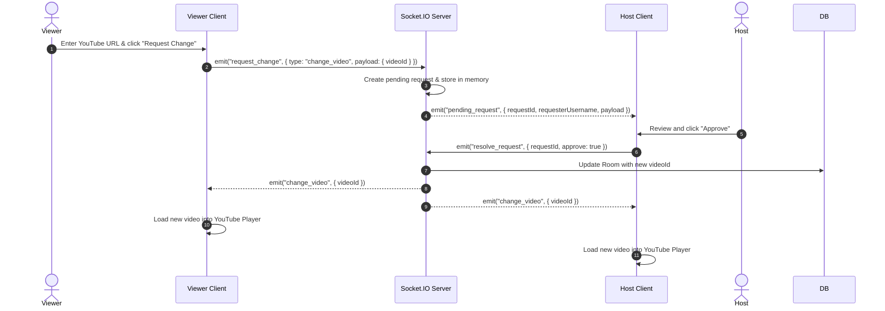
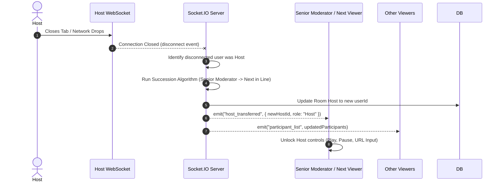

# 🎬 SyncTube — Real-Time YouTube Watch Party

A high-performance, real-time collaborative YouTube watch party platform built with **Next.js 16**, **React 19**, **Socket.IO**, **Tailwind CSS v4**, **Clerk Authentication**, and **MongoDB**. 

Watch YouTube videos together with friends in synchronized sub-300ms playback, role-based controls, automated host succession, interactive live chat, and floating emoji reactions.

---

## ✨ Features

- ⚡ **Sub-300ms Synchronized Playback**: Continuous drift monitoring with intelligent time correction (rate adjustments for small drifts, instant seeking for larger gaps).
- 👑 **Role-Based Permission Hierarchy**:
  - **Host**: Full playback control (Play, Pause, Seek, Load Video), moderator promotion/demotion, host transfer, and change request reviews.
  - **Moderator**: Delegated playback control and participant moderation.
  - **Participant / Viewer**: Synchronized viewing, video change requests, live chat, and emoji reactions.
- 🔄 **Automated Host Succession**: If the current host leaves or disconnects, ownership seamlessly transfers to the senior moderator or next participant in line.
- 📨 **Video Change Request Workflow**: Viewers can request new YouTube videos; hosts and moderators can approve or decline in real time.
- 💬 **Live Chat & Floating Reactions**: Instant messaging with user role badges, timestamping, and animated floating emoji reactions (`👍`, `❤️`, `😂`, `😮`, `🔥`, `🎉`, `👎`, `💯`).
- 📱 **100% Fit-to-Screen Mobile Experience**: Zero whole-page scrolling on mobile devices (`h-[100dvh] overflow-hidden`) with a dedicated tab switcher for Viewers and Live Chat directly below the video player.
- 🖥️ **Adaptive Multi-Tier Desktop View**: Fluid video scaling honoring both screen width and screen height with identical, symmetrical sidebars across laptops, standard monitors, and ultra-wide displays.
- 🌗 **Dark & Light Mode Support**: Glassmorphism aesthetic tailored with custom HSL color systems.

---

## 🏗️ Architecture & Real-Time Sync Engine

```
[ Next.js Client ] ──(WebSocket)──► [ Socket.IO Server (server.ts) ]
        │                                      │
  (Clerk Auth JWT)                    (Sync State Broadcast)
        │                                      ▼
        ▼                              [ Master State Store ]
[ YouTube IFrame API ] ◄──(Heartbeat)── [ Redis / Memory Sync ]
```

### Synchronization Protocol
1. **Master Clock Authority**: The host controls playback state (`playState`, `currentTime`, `videoId`, `playbackRate`).
2. **Heartbeat & Drift Correction**:
   - Clients exchange synchronization heartbeats every `500ms`.
   - **Drift < 300ms**: Seamless playback (no action required).
   - **300ms ≤ Drift ≤ 2000ms**: Micro-speed adjustment (`playbackRate` slightly adjusted to catch up smoothly).
   - **Drift > 2000ms**: Hard seek alignment to master timestamp.

---

## 🔄 Sequence Diagrams

### 1. Room Connection & Initial State Synchronization



### 2. Real-Time Playback Control & Adaptive Drift Correction



### 3. Video Change Request & Approval Workflow



### 4. Automated Host Succession on Disconnect



---

## 🛠️ Technology Stack

| Layer | Technology |
|---|---|
| **Framework** | [Next.js 16 (App Router)](https://nextjs.org) + [React 19](https://react.dev) |
| **Real-Time Engine** | [Socket.IO 4.8](https://socket.io) + [@socket.io/redis-adapter](https://socket.io/docs/v4/redis-adapter/) |
| **Styling** | [Tailwind CSS v4](https://tailwindcss.com) + Lucide Icons + tw-animate-css |
| **Authentication** | [Clerk](https://clerk.com) (JWT verification on WebSocket handshake) |
| **Database** | [MongoDB Atlas](https://www.mongodb.com/atlas) + Mongoose |
| **Caching & Rate Limiting** | [Upstash Redis](https://upstash.com) / Redis URL |
| **State Management** | [Zustand](https://zustand.docs.pmnd.rs) |
| **Video Engine** | YouTube IFrame Player API |

---

## 📁 Directory Structure

```
watch-party-system/
├── app/
│   ├── (auth)/                 # Clerk Sign-In & Sign-Up routes
│   ├── api/                    # Next.js API route handlers (rooms, health)
│   ├── room/[roomId]/          # Watch Party dynamic room page
│   ├── globals.css             # Tailwind CSS tokens, themes & animations
│   ├── layout.tsx              # Root layout with providers & viewport config
│   └── page.tsx                # Landing page with room creation & past history
├── components/
│   ├── room/                   # YouTubePlayer, Chat, ParticipantList, ReactionBar, VideoUrlInput
│   ├── theme/                  # ThemeProvider & ThemeToggle
│   └── ui/                     # Toast notifications & UI components
├── hooks/
│   ├── usePlayerSync.ts        # YouTube IFrame sync & drift correction engine
│   ├── useRoom.ts              # Room state, role status & participant sync
│   └── useSocket.ts            # Socket.IO connection management & event listeners
├── lib/
│   ├── db.ts                   # MongoDB Mongoose connection
│   ├── permissions.ts          # Role hierarchy permission checks
│   ├── socket-client.ts        # Socket.IO client singleton
│   └── youtube.ts              # YouTube URL & Video ID parser
├── models/
│   └── Room.ts                 # MongoDB Room schema & metadata
├── server/
│   ├── socketAuth.ts           # Clerk JWT WebSocket authentication middleware
│   └── socketServer.ts         # Socket.IO room lifecycle & event handlers
├── store/
│   ├── roomStore.ts            # Zustand room store (sync state, chat, participants)
│   └── toastStore.ts           # Toast notification system
├── server.ts                   # Custom Node.js HTTP + Socket.IO server
└── package.json
```

---

## 🚀 Getting Started

### 1. Prerequisites
- **Node.js** v20 or higher
- **npm**, **pnpm**, or **yarn**
- A **MongoDB Atlas** cluster URI
- A **Clerk** account for Authentication keys
- *(Optional)* An **Upstash Redis** or local Redis instance for multi-instance scaling

### 2. Clone and Install Dependencies

```bash
git clone https://github.com/kushalpatel8/watch-party-system.git
cd watch-party-system
npm install
```

### 3. Environment Variables Configuration

Create a `.env.local` file in the root directory and add the following variables:

```env
# Clerk Authentication
NEXT_PUBLIC_CLERK_PUBLISHABLE_KEY=pk_test_...
CLERK_SECRET_KEY=sk_test_...
NEXT_PUBLIC_CLERK_SIGN_IN_URL=/sign-in
NEXT_PUBLIC_CLERK_SIGN_UP_URL=/sign-up

# Database
MONGODB_URI=mongodb+srv://<username>:<password>@cluster.mongodb.net/watch-party?retryWrites=true&w=majority

# App & Socket URL
NEXT_PUBLIC_APP_URL=http://localhost:3000
PORT=3000

# Optional: Redis Adapter for multi-instance socket clustering
# REDIS_URL=redis://localhost:6379
# UPSTASH_REDIS_REST_URL=https://...
# UPSTASH_REDIS_REST_TOKEN=...
```

### 4. Run the Development Server

```bash
npm run dev
```

Open [http://localhost:3000](http://localhost:3000) in your browser.

---

## 📜 Available Scripts

| Command | Purpose |
|---|---|
| `npm run dev` | Starts the custom Node.js server with TypeScript watch mode (`tsx watch server.ts`) |
| `npm run build` | Compiles Next.js bundle and TypeScript server files (`next build && tsc -p tsconfig.server.json`) |
| `npm run start` | Runs the compiled production server (`node dist/server.js`) |
| `npm run lint` | Runs ESLint checks across the codebase |

---

## 👥 Role Permissions Matrix

| Capability | Host 👑 | Moderator 🛡️ | Participant 👤 |
|---|:---:|:---:|:---:|
| Play / Pause / Seek Video | ✅ | ✅ | ❌ |
| Load New YouTube URL | ✅ | ✅ | ❌ |
| Request Video Change | ❌ | ❌ | ✅ |
| Approve / Reject Change Requests | ✅ | ✅ | ❌ |
| Promote to Moderator | ✅ | ❌ | ❌ |
| Demote to Participant | ✅ | ❌ | ❌ |
| Kick / Remove Viewers | ✅ | ❌ | ❌ |
| Transfer Host Privileges | ✅ | ❌ | ❌ |
| Live Chat & Emoji Reactions | ✅ | ✅ | ✅ |

---

## 👤 Author

**Kushal Patel**
- GitHub: [@kushalpatel8](https://github.com/kushalpatel8)

---

## 🛡️ License

This project is open source and available under the [MIT License](LICENSE).
